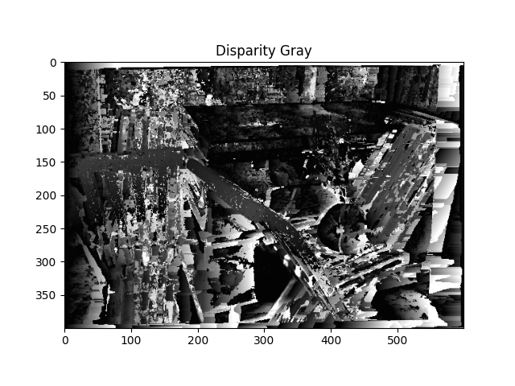
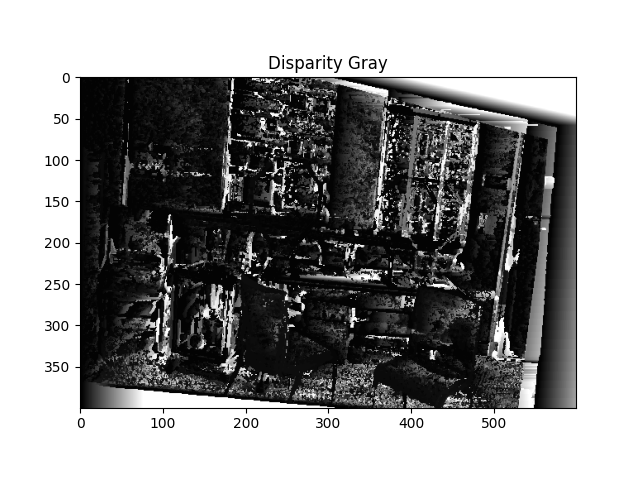
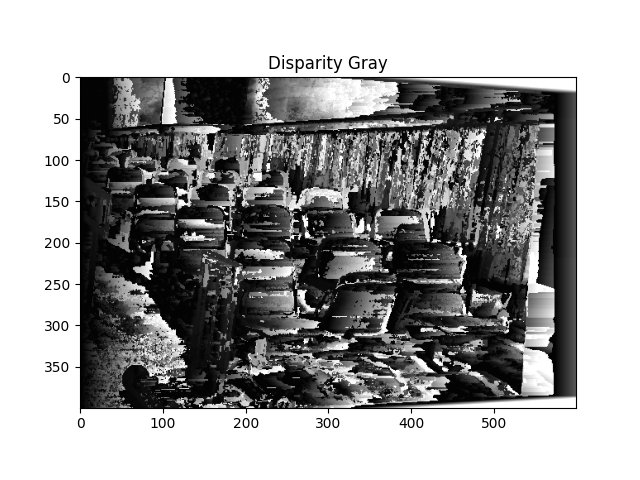
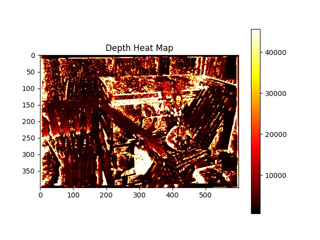
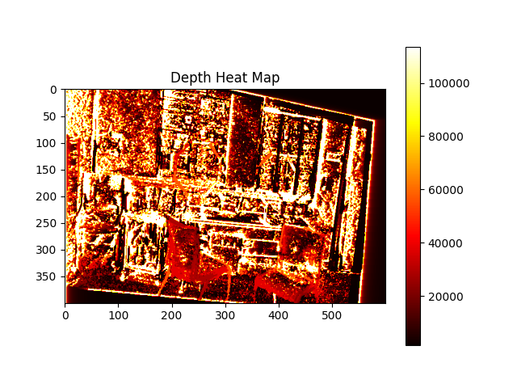
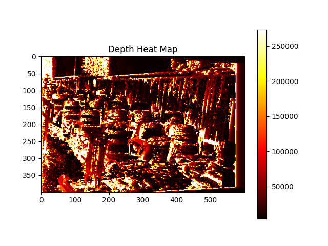

# Depth Estimation Using Stereo Cameras
## Overview
The main idea of solving for depth using a stereo camera involves the concept of triangulation and stereo matching. The formal depends on good calibration and rectification to constrain the problem so that it can be model on a 2D plane known as the epipolar plane, which greatly reduces the latter to a line search along the epipolar line.
## Approach
1. Identify similar points from feature descriptors.
2. Match feature correspondence using a matching cost function.
3. Using epipolar geometry, find and match correspondence in one picture frame to the other.
4. Compute disparity from known correspondence.
5. Compute depth from known disparity.

## To run the code
```bash
git clone https://github.com/Prat33k-dev/Stereo_Depth_Estimation.git
cd Stereo_Depth_Estimation/code
python3 stereo.py --filePath ../data_files/ --dataset 1
```
### Parameters
- FilePath -  Dataset Path file path. *Default :- '../data_files/'*
- dataset - Dataset Number . *Default :- '1'*

## Results
### CALIBRATION
Matches             |
:-------------------------:|
 |
 |
 |

### RECTIFICATION
Epipolar lines for unrectified images  |
:-------------------------:|
 |
 |
 |


Epipolar lines for rectified images  |
:-------------------------:|
 |
 |
 |

### CORRESPONDENCE
Disparity Map |
:-------------------------:|
 |
 |
 |

### DEPTH
Depth Map |
:-------------------------:|
 |
 |
 |